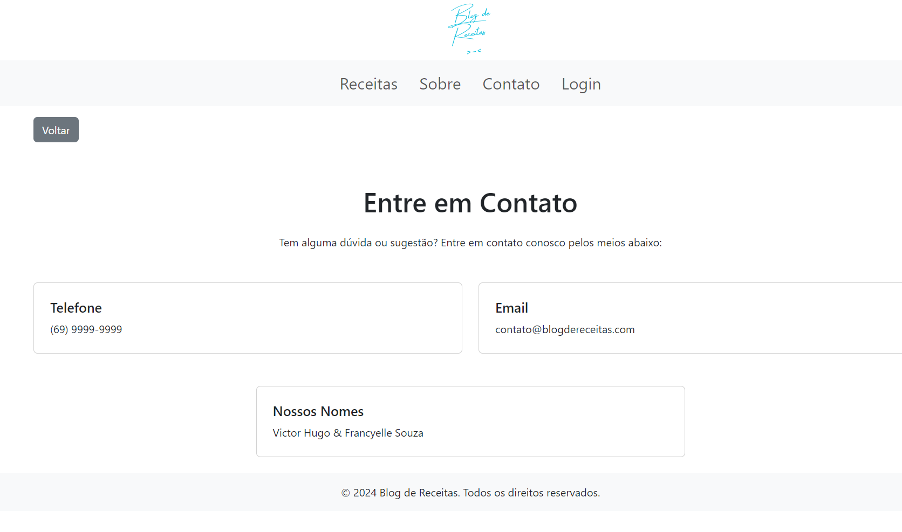
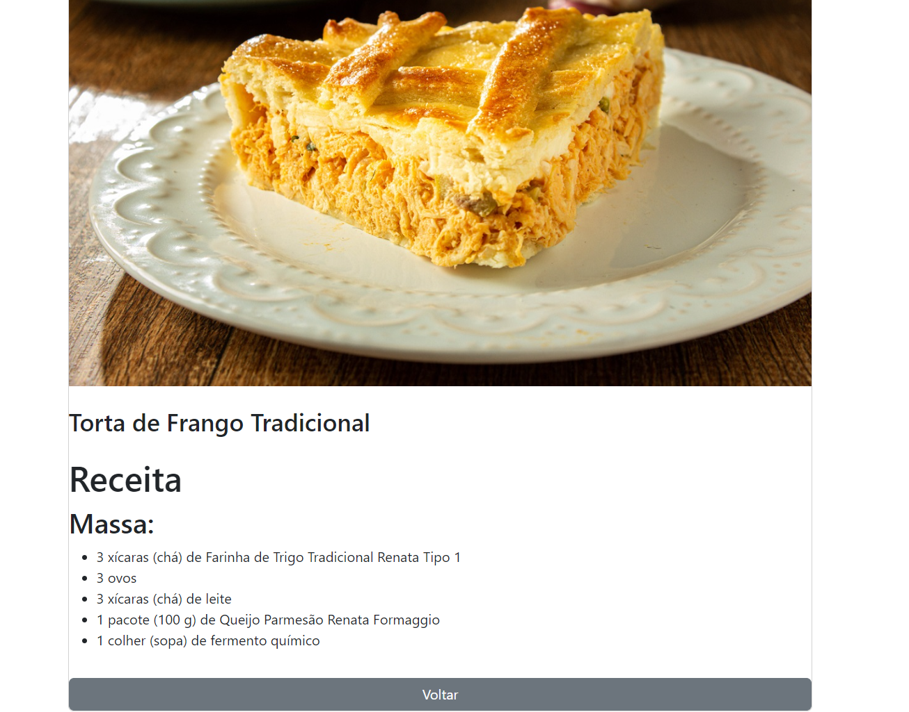
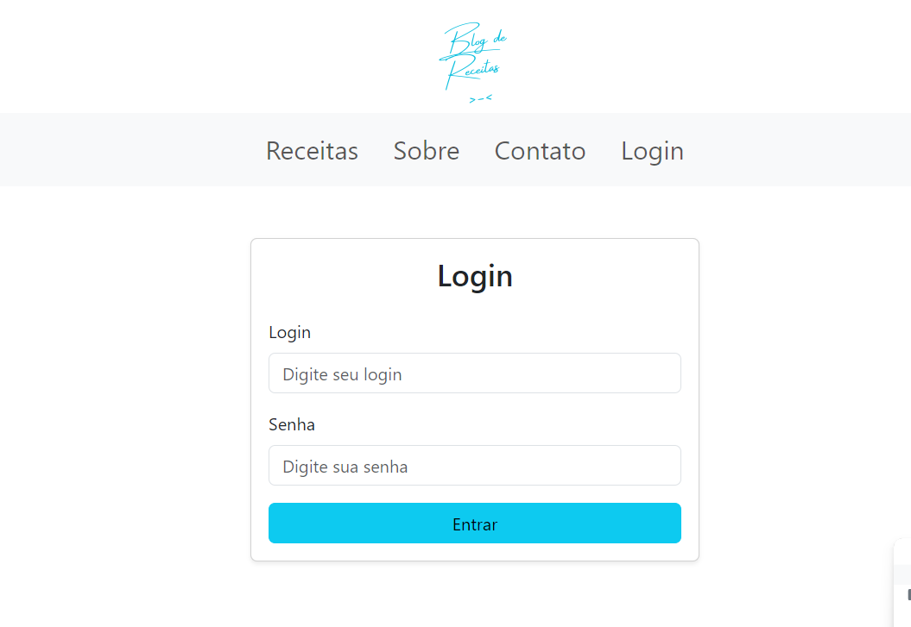
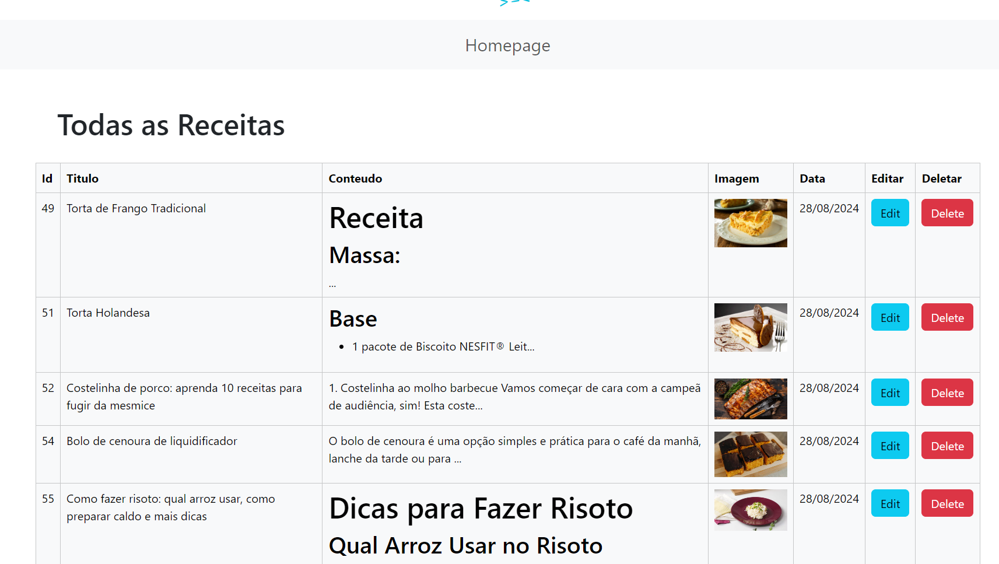
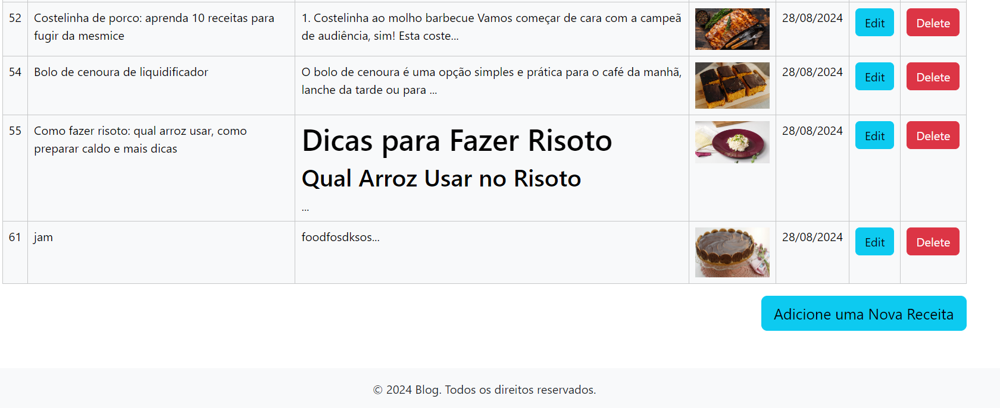

# Blog de Receitas 

### Descrição

O blog de receitas é uma plataforma  onde os usuários podem visualizar e 
explorar receitas culinárias de maneira simples e intuitiva. A principal funcionalidade do site 
é permitir que os usuários acessem receitas, e também tem um dashboard personalizado para o administrador poder
adicionar, remover e editar suas receitas, além disso há a visualização de todas as receitas em um formato de tabela junto com 
a data de criação.

## Imagens

### homepage

### Sobre 

### Contato

### Blog

### Login

### Dashboard

